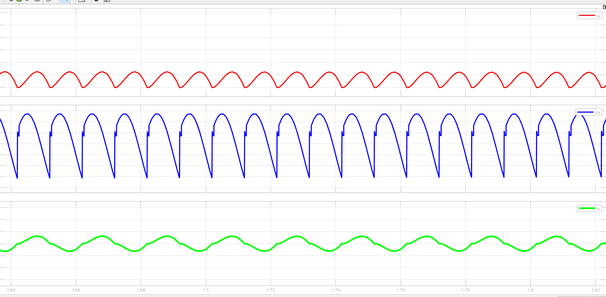

# MATLAB-SIMULINK 

This repository contains a collection of MATLAB scripts, Simulink models, and their corresponding outputs including characteristics plots and figures. It's intended as a central hub for organizing and showcasing simulations and analyses related to various electrical engineering and control systems topics.

---

## 📁 Repository Structure
MATLAB-SIMULINK/│
├── MATLAB_SCRIPTS/ # .m files for analysis, computation, plotting, etc. 
├── SIMULINK_MODELS/ # .slx models for simulation-based studies 
├── PLOTS/ # Output plots, response curves, and diagrams 
└── README.md # You're here!


##  Contents

This repository currently includes work on:

- Power Electronics converters (Buck, Boost, Buck-Boost, Inverters)
- Load Flow Analysis (e.g., Y-Bus Matrix construction)
- Power System Stability (Root locus, Bode plots, etc.)
- Control Systems (Two-area LFC, VF control models)
- Transmission Line studies (Ferranti effect, fault analysis)
- Custom activation functions and signal plots

##  Requirements

- MATLAB (R2021b or later recommended)
- Simulink Toolbox
- Control System Toolbox (for specific scripts)
- Simscape Electrical

#### 🔌Sample Output Waveform
- 🔌 DC MOTOR AT NO LOAD


- THREE PHASE INVERTER OUTPUT


##  Usage

1. Clone the repository:
   ```bash
   git clone https://github.com/F7Z7/MATLAB-SIMULINK.git

   
   
---

## 🙌 Conclusion

- This repository is a personal learning and development space for MATLAB and Simulink projects, particularly in the domains of power systems, control systems, and signal analysis.
- If you find this repository useful or would like to collaborate on related projects, feel free to connect! Contributions, suggestions, or ideas are always welcome.

Thanks for stopping by! 🚀


